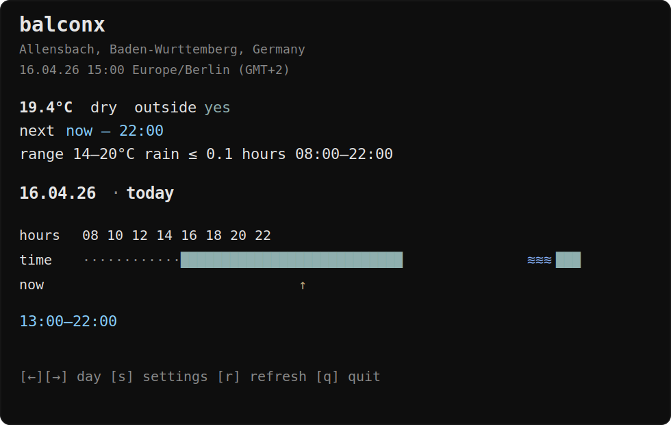

# balconx

Tiny terminal weather app for one question: **when is it nice enough to work on the balcony?**

`balconx` checks your local forecast and shows time windows where:
- temperature is within your preferred range
- rain stays below your threshold
- only hours within your configured daily time range are considered

It opens as a small interactive terminal app.



## Features

- start with just:
  ```bash
  balconx
  ```
- minimal terminal UI
- today view by default
- left/right day navigation for today + next 5 days
- location lookup by city / zip / place name
- timezone-aware forecast handling
- adjustable:
  - location
  - active hours
  - temperature range
  - rain threshold
- machine-readable JSON mode for scripts/agents

## Stack

- Bun
- TypeScript
- Open-Meteo forecast API
- Open-Meteo geocoding + Nominatim reverse geocoding

## Install

### Local

```bash
bun install
bun run build
```

Run with:

```bash
bun run src/index.ts
```

or after build:

```bash
bun run dist/index.js
```

### Global with Bun

```bash
bun run install:global
```

Or use the helper scripts:

```powershell
./scripts/install-global.ps1
```

```bash
sh ./scripts/install-global.sh
```

Then run:

```bash
balconx
```

If `balconx` is not found, open a new terminal first. If it still is not found, add the directory printed by `bun pm bin` to your `PATH`.

## First run

On first start, `balconx` creates config in:

```txt
~/.balconx/config.json
```

Location is stored internally as lat/lon, but inside the app you can use place lookup instead of entering coordinates manually.

## Usage

### Interactive app

```bash
balconx
```

Keys:

- `←` / `→` browse days
- `s` settings
- `r` refresh
- `q` quit
- `esc` back from settings

### Settings

Inside settings:

- `l` lookup place
- `h` active hours
- `t` temperature range
- `p` rain threshold

### JSON mode

```bash
balconx --json now
balconx --json today
balconx --json tomorrow
balconx --json next
```

Example:

```json
{
  "mode": "now",
  "location": "Berlin, Germany, Mitte",
  "date": "2026-04-16",
  "time": "15:00",
  "goodNow": true,
  "temperature": 19.4,
  "precipitation": 0,
  "timezone": "Europe/Berlin"
}
```

## Forecast rules

Default rules are:

- min temp: `14°C`
- max temp: `20°C`
- max precipitation: `0.1`
- active hours: `08:00–22:00`

You can change all of these in settings.

## Development

```bash
bun install
bun test
bun run build
bun run dev
```

## Notes

- all day calculations use the forecast location timezone
- displayed windows are hourly forecast buckets, not exact minute precision
- this is intentionally a small personal tool with a terminal-app feel
